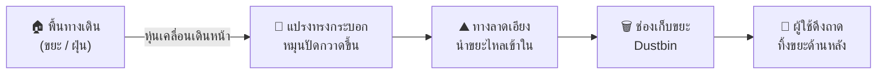

# 🤖 รายละเอียดส่วนประกอบทางกายภาพของหุ่นยนต์
## (Physical & Mechanical Component Breakdown)

วิเคราะห์จากภาพสเก็ต 4 มุมมอง: ด้านข้าง (Side View), มุม 3 มิติ (Isometric View), ด้านหน้า (Front View), และด้านหลัง (Rear View)

---

## ภาพรวมโครงสร้างหุ่นยนต์ (Overview)

หุ่นยนต์มีรูปทรงเป็น **กล่องสี่เหลี่ยมผืนผ้า** ตั้งบนล้อ มีแขนยื่นยาวจากด้านบนไปข้างหน้าสำหรับติดกล้อง และมีแปรงทรงกระบอกติดอยู่บริเวณด้านหน้าล่าง โครงสร้างแบ่งออกเป็น **8 ส่วนประกอบหลัก** ดังนี้:

```mermaid
graph TB
    subgraph ส่วนบน
        A[1. แขนหอกล้อง<br>Camera Tower Arm]
        B[2. ฐานยึดกล้องและเซอร์โว<br>Camera & Servo Mount]
    end
    
    subgraph ส่วนตัวถัง
        C[3. โครงตัวถังหลัก<br>Main Chassis Frame]
        D[4. แผงปิดตัวถัง<br>Body Panels / Shell]
    end
    
    subgraph ส่วนหน้า
        E[5. แปรงทรงกระบอก<br>Cylindrical Roller Brush]
        F[6. ทางลาดนำขยะ<br>Incline Ramp]
    end
    
    subgraph ส่วนหลัง
        G[7. ช่องเก็บขยะ<br>Dustbin Compartment]
    end
    
    subgraph ส่วนล่าง
        H[8a. ล้อขับเคลื่อน x2<br>Drive Wheels]
        I[8b. ล้อประคอง x2<br>Caster Wheels]
    end
    
    A --> B
    B --> C
    C --> D
    C --> E
    E --> F
    F --> G
    C --> H
    C --> I
```

---

## 1. 🏗️ โครงตัวถังหลัก (Main Chassis Frame)

| รายการ | รายละเอียด |
|---|---|
| **ตำแหน่ง** | เป็นโครงสร้างกลางของหุ่นยนต์ทั้งหมด มองเห็นได้ชัดในทุกมุมมองเป็น **ทรงกล่องสี่เหลี่ยมผืนผ้า** |
| **วัสดุ** | อลูมิเนียมโปรไฟล์ขนาด 20x20 มม. (รหัส 2020) ประกอบเข้ามุมด้วยฉากเหล็ก (Corner Brackets), T-Nuts, และ Gussets |
| **มิติโดยประมาณ** | กว้าง 30 ซม. × ยาว 80 ซม. × สูง (ตัวถังไม่รวมแขนกล้อง) ประมาณ 25-30 ซม. |
| **ฟังก์ชันการทำงาน** | ทำหน้าที่เป็น **โครงกระดูกสันหลัง (Skeleton)** ของหุ่นยนต์ทั้งหมด รองรับน้ำหนักของอุปกรณ์อิเล็กทรอนิกส์ (MCU, Motor Driver, แบตเตอรี่, Power Bank), รองรับแรงบิดจากมอเตอร์ขับเคลื่อน, รับแรงสั่นสะเทือนจากการเคลื่อนที่บนพื้นผิวไม่เรียบ และเป็นจุดยึดสำหรับส่วนประกอบทุกชิ้นรวมถึงแขนกล้อง แปรงปัด ล้อ และช่องเก็บขยะ |
| **คุณสมบัติพิเศษ** | ระบบ T-Slot ของอลูมิเนียมโปรไฟล์ช่วยให้สามารถเลื่อนตำแหน่งยึดอุปกรณ์ได้ตามแนวราง โดยไม่ต้องเจาะรูใหม่ ทำให้ปรับจุดศูนย์ถ่วง (Center of Gravity) และตำแหน่งของชิ้นส่วนต่างๆ ได้สะดวกในช่วงพัฒนาต้นแบบ |

---

## 2. 📷 แขนหอกล้อง (Camera Tower Arm)

| รายการ | รายละเอียด |
|---|---|
| **ตำแหน่ง** | ยื่นออกจาก **ด้านบน-หลัง** ของตัวถังไปทาง **ด้านหน้า-บน** ในลักษณะแขนยื่นเอียงขึ้น (Boom Arm / Cantilever) สังเกตได้ชัดเจนจากมุมมองด้านข้าง (Side View) ที่แขนยื่นยาวจากหลังคาตัวถังไปข้างหน้า |
| **วัสดุ** | อลูมิเนียมโปรไฟล์ 2020 หรือท่ออลูมิเนียมกลม พร้อมข้อต่อมุมที่จุดโคนยึดกับตัวถัง |
| **ฟังก์ชันการทำงาน** | ทำหน้าที่เป็น **หอสังเกตการณ์ (Observation Tower)** ยกระดับความสูงของกล้อง (ESP32-CAM) ขึ้นไปจากระดับพื้นหุ่นยนต์ เพื่อให้มุมกล้องอยู่ในตำแหน่งที่เหมาะสมสำหรับถ่ายภาพมิเตอร์น้ำ (ติดตั้งระดับต่ำใกล้พื้น) และมิเตอร์ไฟ (ติดตั้งสูงบนผนัง) ซึ่งมีระยะห่างในแนวดิ่งประมาณ 40 ซม. โดยไม่จำเป็นต้องขยับตัวหุ่นยนต์ขึ้น-ลง |
| **เหตุผลเชิงการออกแบบ** | การวางแขนยื่นไปข้างหน้าทำให้กล้องอยู่ตำแหน่งใกล้กับมิเตอร์ (อยู่ด้านหน้าตัวถัง) โดยไม่ถูกบังด้วยโครงสร้างตัวถังเอง และยังช่วยให้มุมมอง Live Stream ของ Web UI เป็นมุม First-Person View ที่มองไปข้างหน้าได้ไกล |

---

## 3. 📐 ฐานยึดกล้องและเซอร์โว (Camera & Servo Mount)

| รายการ | รายละเอียด |
|---|---|
| **ตำแหน่ง** | อยู่บริเวณ **ปลายสุดของแขนหอกล้อง** สังเกตได้จากมุมมองด้านข้าง (Side View) เป็นชิ้นส่วนสี่เหลี่ยมเล็กๆ ติดอยู่บนยอดของแขน |
| **วัสดุ** | แผ่นอะคริลิกตัดด้วยเลเซอร์ หรือชิ้นส่วน 3D Print (PLA/PETG) ออกแบบให้มีช่องยึด Servo SG90 และตัวบอร์ด ESP32-CAM |
| **ฟังก์ชันการทำงาน** | ทำหน้าที่เป็น **ข้อต่อหมุนแกนเดียว (Single-Axis Gimbal)** ยึด Servo Motor SG90 ไว้กับปลายแขน แล้วยึด ESP32-CAM เข้ากับแขนหมุนของ Servo โดยตรง เมื่อ Servo หมุนจะทำให้กล้องก้มลง (Tilt Down) เพื่อมองมิเตอร์น้ำ หรือเงยขึ้น (Tilt Up) เพื่อมองมิเตอร์ไฟ ครอบคลุมช่วงมุม 0° - 180° |
| **ข้อจำกัดในการออกแบบ** | ฐานยึดต้องมีความแข็งแรงและไม่สั่นสะเทือน เพราะหากกล้องสั่นในขณะถ่ายภาพ จะทำให้ภาพมิเตอร์เบลอและอ่านตัวเลข OCR ไม่ได้ จึงแนะนำให้ใช้วัสดุหนาอย่างน้อย 3 มม. และยึดสกรูแน่น |

---

## 4. 🧹 แปรงทรงกระบอก (Cylindrical Roller Brush)

| รายการ | รายละเอียด |
|---|---|
| **ตำแหน่ง** | ติดตั้งอยู่บริเวณ **ด้านหน้า-ล่าง** ของตัวถัง ในลักษณะแกนหมุนขวางลำตัว (แนวนอน) มองเห็นได้ชัดเจนจากมุมมองด้านข้าง (Side View) เป็นทรงกระบอกกลมอยู่ใต้จมูกหุ่น และจากมุมมองไอโซเมตริก (Isometric View) เป็นแท่งกลมยาวพาดขวางหน้าหุ่น |
| **วัสดุแปรง** | ขนแปรงไนลอน (Nylon Bristles) หรือแผ่นยาง (Rubber Flap) ปักเรียงรอบแกนกลมที่ทำจากท่อ PVC หรือชิ้นงาน 3D Print |
| **ขนาดโดยประมาณ** | เส้นผ่านศูนย์กลางแปรงประมาณ 5-8 ซม. × ความยาวเท่ากับความกว้างของตัวถัง (ประมาณ 25-30 ซม.) |
| **ฟังก์ชันการทำงาน** | ทำหน้าที่เป็น **กลไกทำความสะอาดหลัก (Primary Cleaning Mechanism)** เมื่อมอเตอร์แปรงถูกเปิดใช้งาน แปรงจะหมุนรอบแกนของตัวเอง (คล้ายลูกกลิ้งซักผ้า) ขนแปรงจะปัดกวาดเศษขยะ ฝุ่น และวัตถุขนาดเล็กบนพื้นทางเดินขึ้นมาจากพื้น แล้วเหวี่ยง/ส่งต่อขึ้นไปบน **ทางลาดเอียง (Incline Ramp)** ที่อยู่ด้านหลังแปรง |
| **ทิศทางการหมุน** | หมุนวนเข้าหาตัวถัง (Inward Rotation) เพื่อตักขยะจากพื้นขึ้นมาแล้วส่งขึ้นทางลาดเข้าถังเก็บ |
| **แรงขับ** | มอเตอร์ DC เกียร์ทดอิสระ 1 ตัว ควบคุมผ่าน Relay Module → GPIO 19 ของ MCU 1 (เปิด/ปิดเท่านั้น ไม่ปรับความเร็ว) |

---

## 5. ⛰️ ทางลาดนำขยะ (Incline Ramp / Debris Guide)

| รายการ | รายละเอียด |
|---|---|
| **ตำแหน่ง** | อยู่ระหว่าง **แปรงทรงกระบอก (ด้านหน้า)** กับ **ช่องเก็บขยะ (ด้านใน)** เป็นแผ่นเอียงอยู่ภายในตัวถัง สังเกตได้จากมุมมองด้านข้าง (Side View) ที่พื้นด้านในตัวถังลาดเอียงจากระดับแปรงขึ้นไปสู่ช่องเก็บ |
| **วัสดุ** | แผ่นอะคริลิก, แผ่นอลูมิเนียมบาง, หรือแผ่นพลาสติก POM ผิวเรียบลื่น |
| **มุมเอียง** | ประมาณ 15° - 30° จากแนวระนาบ (ปรับได้ตามขนาดและน้ำหนักของขยะที่ต้องการกวาด) |
| **ฟังก์ชันการทำงาน** | ทำหน้าที่เป็น **ทางลื่นนำขยะ (Debris Chute)** รับวัตถุที่ถูกแปรงเหวี่ยงขึ้นมาจากระดับพื้น แล้วนำทางให้วัตถุไหลลื่นตามแรงโมเมนตัมลงไปตกในช่องเก็บขยะด้านใน ผิวของทางลาดต้องเรียบลื่นเพื่อลดแรงเสียดทาน ป้องกันไม่ให้ขยะติดค้างระหว่างทาง |

---

## 6. 🗑️ ช่องเก็บขยะ (Dustbin Compartment)

| รายการ | รายละเอียด |
|---|---|
| **ตำแหน่ง** | อยู่บริเวณ **ด้านหลัง-ล่าง** ของตัวถัง สังเกตได้ชัดเจนจากมุมมองด้านหลัง (Rear View) เป็น **แผงฝาเปิด/ลิ้นชัก (Drawer Panel)** สี่เหลี่ยมผืนผ้าอยู่บริเวณครึ่งล่างของหุ่น |
| **วัสดุ** | กล่องพลาสติก หรือถาดอะคริลิก/โลหะบาง ที่สามารถดึงออกมาเทขยะได้ |
| **ฟังก์ชันการทำงาน** | ทำหน้าที่เป็น **ถังพักขยะ (Collection Bin)** รองรับเศษขยะ ฝุ่น และวัตถุขนาดเล็กที่ถูกกวาดเข้ามาผ่านแปรงและทางลาดเอียง ออกแบบให้มีฝาเปิดหรือลิ้นชักดึงออกได้ทางด้านหลังของหุ่นยนต์ เพื่อให้ผู้ใช้งานสามารถเทขยะทิ้งได้ง่ายโดยไม่ต้องถอดประกอบตัวหุ่น |
| **เหตุผลเชิงการออกแบบ** | การวางช่องเก็บขยะไว้ด้านหลังเป็นทางเลือกที่เหมาะสม เพราะ: (1) น้ำหนักของขยะที่สะสมจะอยู่ใกล้กับแกนล้อขับเคลื่อนหลัก ทำให้ไม่รบกวนจุดศูนย์ถ่วงมากนัก (2) ฝาเปิดด้านหลังไม่กีดขวางการทำงานของแปรงด้านหน้า (3) ผู้ใช้งานสามารถเข้าถึงได้จากด้านท้ายโดยไม่ต้องยกหุ่นขึ้น |

---

## 7. 🛡️ แผงปิดตัวถัง (Body Panels / Shell)

| รายการ | รายละเอียด |
|---|---|
| **ตำแหน่ง** | ปิดครอบรอบโครงอลูมิเนียมโปรไฟล์ทั้ง 4 ด้าน (หน้า, หลัง, ซ้าย, ขวา) และด้านบน (หลังคา) มองเห็นได้จากมุมมอง Isometric, Front View และ Rear View เป็นผิวเรียบที่ปิดทับโครงกระดูก |
| **วัสดุ** | แผ่นอะคริลิกตัดเลเซอร์, แผ่น PVC โฟมบอร์ด, หรือแผ่นโลหะบาง ยึดเข้ากับราง T-Slot ของอลูมิเนียมโปรไฟล์ |
| **ฟังก์ชันการทำงาน** | (1) **ปกป้องอุปกรณ์ภายใน:** ป้องกันฝุ่น น้ำ และแรงกระแทกจากภายนอกไม่ให้กระทบแผงวงจร แบตเตอรี่ สายไฟ และ Motor Driver ที่ติดตั้งอยู่ภายใน (2) **ให้ความสวยงามและความเป็นมืออาชีพ:** ทำให้หุ่นยนต์มีรูปลักษณ์ภายนอกเรียบร้อยสำหรับการนำเสนอโครงงาน (3) **ป้องกันนิ้วหนีบ:** ปิดกั้นเฟืองมอเตอร์และชิ้นส่วนเคลื่อนไหวไม่ให้มือผู้ใช้สัมผัสโดยไม่ตั้งใจ |

---

## 8. 🔄 ระบบล้อ (Wheel System)

### 8a. ล้อขับเคลื่อนหลัก (Main Drive Wheels)
| รายการ | รายละเอียด |
|---|---|
| **ตำแหน่ง** | ติดตั้งบริเวณ **กึ่งกลาง-หลัง** ของตัวถัง จำนวน **2 ล้อ** (ซ้าย-ขวา) สังเกตได้จากมุมมองด้านข้าง (Side View) เป็นล้อวงกลมขนาดใหญ่ 2 ล้อ |
| **ขนาด** | เส้นผ่านศูนย์กลาง **120 มม. (Ø12 ซม.)** |
| **ฟังก์ชันการทำงาน** | เป็นล้อหลักที่ให้กำลังขับเคลื่อนหุ่นยนต์ทั้งเดินหน้า ถอยหลัง เลี้ยว และหมุนตัว ต่อพ่วงเข้ากับแกนมอเตอร์เกียร์ (25GA-370) โดยตรง |

### 8b. ล้อประคอง (Caster Wheels)
| รายการ | รายละเอียด |
|---|---|
| **ตำแหน่ง** | ติดตั้งบริเวณ **มุมด้านหน้า-ล่าง** ของตัวถัง จำนวน **2 ล้อ** (ซ้าย-ขวา) สังเกตได้จากมุมมองด้านข้าง (Side View) เป็นล้อวงกลมขนาดเล็กอยู่ใต้จมูกหุ่น และจากมุมมอง Isometric เห็นล้อเล็กโผล่ออกมาจากมุมล่าง |
| **ขนาด** | เส้นผ่านศูนย์กลาง **50 มม. (Ø5 ซม.)** |
| **ฟังก์ชันการทำงาน** | หมุนอิสระ 360° ไม่มีมอเตอร์ ทำหน้าที่ประคองสมดุลด้านหน้าของตัวถังเพื่อไม่ให้หุ่นเอียงคว่ำ และช่วยให้การเลี้ยวและหมุนตัว Zero-Turn เป็นไปอย่างลื่นไหลโดยไม่ต้านแรง |

---

## สรุปการไหลของกลไกทำความสะอาด (Cleaning Mechanism Flow)


